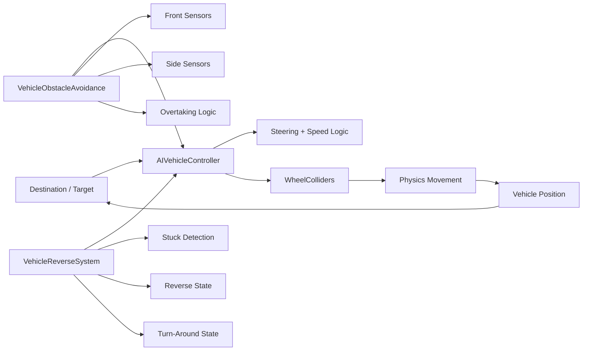

<div align="center">


<br/>


<br/><br/>

<a href="https://github.com/AminHasanloo/Unity-AI-Vehicle-System/stargazers"></a>
<a href="https://github.com/AminHasanloo/Unity-AI-Vehicle-System/network/members"></a>

</div>

---

## 🎮 Overview

**Unity AI Vehicle System** is a modular vehicle-AI experiment for Unity focused on believable autonomous driving behavior using **WheelCollider physics**, steering logic, multi-ray obstacle sensing, overtaking behavior, reverse recovery, and anti-stuck support.

The project is designed as a gameplay and simulation R&D base rather than a black-box driving plugin. The core scripts expose their behavior in the Inspector so steering, speed, sensors, recovery distances and avoidance response can be tuned for different vehicle types and scenes.

> The current public repository contains the vehicle-control and vehicle-AI scripts plus an optional armament folder. It does **not** currently include a complete Unity demo scene or every class referenced by the optional combat scripts, so the safest starting point is the `AiVehicle/Wheel` module.

---

## ✨ Feature Set

### 🚗 Autonomous Vehicle Control
- Physics-driven movement through Unity `WheelCollider`
- Configurable center of mass, motor force and brake torque
- Dynamic speed states for cruising, boosting, cornering and approach braking
- Target-directed steering with configurable sensitivity and steering limits
- Runtime engine-pitch feedback based on current speed

### 🧠 Multi-Sensor Obstacle Avoidance
- Configurable front sensor array
- Angled + direct side sensors
- Danger and caution zones
- Weighted avoidance steering
- Smoothed steering response
- Simple path prediction from obstacle normals
- Corner-cutting / racing-line style steering when the route is clear

### 🏁 Overtaking Behavior
- Detects blocked forward space
- Checks side clearance before overtaking
- Chooses an overtaking side using target direction and sensor availability
- Applies a temporary avoidance steering bias to complete the maneuver

### ↩️ Reverse & Recovery State Machine
- Detects low-speed stuck conditions
- Detects target-behind / overshoot situations
- Chooses between in-place turning and reversing
- Reverse target distance adapts to rear obstacles
- Waits for forward clearance before returning to normal behavior

### 🧱 Anti-Stuck Support
- Wheel-level anti-stuck component hooks are present in the vehicle controller
- Intended to reduce persistent immobilization around collision geometry

### 🎯 Optional Combat / Turret Scripts
The repository also includes an `Armament` folder with turret and gun-control scripts. These show experiments around:
- AI turret tracking
- Line-of-sight checks
- Projectile firing
- Barrel recoil
- Target spread / shot inaccuracy

**Important:** the current public armament scripts reference an `AITankController` class that is not present in this repository, so treat the armament folder as an integration example / partial subsystem until that dependency is restored or replaced.

---

## 🧠 System Architecture



### Core responsibility split

| Script | Responsibility |
|---|---|
| `AIVehicleController.cs` | Target steering, speed selection, wheel torque/braking, basic movement loop |
| `VehicleObstacleAvoidance.cs` | Raycast sensing, avoidance weighting, overtaking decisions |
| `AIVehicleReverseSystem.cs` | Stuck detection, reverse behavior, turn-around recovery state machine |
| `VehicleController.cs` | Manual vehicle control / WheelCollider baseline |
| `VehiclesAntiStuckSystem.cs` | Wheel-level anti-stuck support |
| `AITurret.cs` | Optional AI turret logic / line-of-sight / target tracking |
| `GunsController.cs` | Optional projectile firing, recoil, muzzle flash and audio |

---

## 🎥 Existing Demo Media

The repository already includes demo media links from the original README:


▶ **Video:**  
https://github-production-user-asset-6210df.s3.amazonaws.com/103859433/412818215-40b54e94-deee-4711-bdd6-9294ad92379f.webm

---

## 🚀 Quick Start

### 1. Copy the vehicle scripts
Use the scripts from:

```text
AiVehicle/Wheel/
```

Core files:

```text
AIVehicleController.cs
AIVehicleReverseSystem.cs
VehicleController.cs
VehicleObstacleAvoidance.cs
VehiclesAntiStuckSystem.cs
```

### 2. Prepare the vehicle GameObject
Recommended components:

```text
Rigidbody
AudioSource                       (optional)
AIVehicleController
VehicleObstacleAvoidance
VehicleReverseSystem              (class inside AIVehicleReverseSystem.cs)
WheelColliders
```

### 3. Configure wheels
For each wheel entry, assign:
- `WheelCollider`
- visual wheel transform
- whether that wheel receives motor torque
- whether that wheel steers

### 4. Configure the target
Assign a `Transform` to:

```csharp
aiVehicleController.destination = targetTransform;
```

The controller uses the destination position as its driving target.

### 5. Configure obstacle layers
Create a layer for environment / blocking geometry and assign it to:

```text
AIVehicleController.obstacleLayer
VehicleObstacleAvoidance.obstacleLayer
VehicleReverseSystem.obstacleLayer
```

### 6. Tune behavior
Start with conservative speed and sensor values, then tune in-scene using Gizmos.

---

## ⚙️ Key Tuning Parameters

### `AIVehicleController`

```csharp
public float detectionRange = 50f;
public float targetReachedDistance = 5f;
public float maxSteerAngle = 35f;
public float steeringSensitivity = 2f;

public float normalSpeed = 100f;
public float boostSpeed = 150f;
public float corneringSpeed = 70f;
public float brakingDistance = 15f;
```

### `VehicleObstacleAvoidance`

```csharp
public float sensorLength = 20f;
public int frontSensorCount = 5;
public float sideSensorAngle = 45f;

public float dangerZone = 5f;
public float cautionZone = 10f;
public float smoothing = 5f;

public float overtakeDistance = 15f;
public float racingLineOffset = 3f;
```

### `VehicleReverseSystem`

```csharp
public float stuckCheckDuration = 2f;
public float minimumSpeedThreshold = 2f;
public float obstacleCheckDistance = 1.5f;

public float reverseTime = 2f;
public float reverseTorque = 1000f;
public float minReverseDistance = 3f;
public float maxReverseDistance = 8f;
```

---

## 🔬 Behavior Pipeline

```text
Target Position
     ↓
Heading / Angle Calculation
     ↓
Obstacle Sensors ───────┐
     ↓                  │
Avoidance Weighting     │
     ↓                  │
Steering Decision ◄─────┘
     ↓
Speed Selection
     ↓
Wheel Torque / Brake Torque
     ↓
Physics Movement
     ↓
Stuck / Overshoot Detection
     ↓
Reverse or Turn Recovery
```

This keeps the driving behavior understandable and debuggable. Instead of one opaque AI controller, navigation, sensing and recovery are separated into different scripts.

---

## 🧪 Debugging & Gizmos

The current scripts expose useful scene diagnostics:

- target direction line
- detection range sphere
- braking range sphere
- obstacle sensor rays
- caution / danger zones
- predicted avoidance direction
- reverse target visualization

Turn on Gizmos in the Scene view while tuning. For vehicle AI, these visual signals are often more useful than raw Console logs.

---

## ⚠️ Compatibility Notes

The public scripts use:

```csharp
rb.linearVelocity
```

which is appropriate for newer Unity versions. If you are integrating the scripts into an older Unity project where `Rigidbody.linearVelocity` is unavailable, replace it with the equivalent velocity property for that Unity version.

The repository also uses `UnityEngine.AI` for target sampling / path-related utility, so make sure the required Unity AI Navigation / NavMesh support is available in your project if you keep that code path.

---

## 📁 Repository Structure

```text
Unity-AI-Vehicle-System/
├── AiVehicle/
│   ├── Wheel/
│   │   ├── AIVehicleController.cs
│   │   ├── AIVehicleReverseSystem.cs
│   │   ├── VehicleController.cs
│   │   ├── VehicleObstacleAvoidance.cs
│   │   └── VehiclesAntiStuckSystem.cs
│   └── Armament/
│       ├── AITurret.cs
│       ├── GunsController.cs
│       └── TurretController.cs
├── LICENSE
└── README.md
```

---

## 🗺️ Roadmap

- [ ] Add a clean Unity demo scene
- [ ] Add prefab setup examples
- [ ] Add package-ready folder structure
- [ ] Add editor setup helper
- [ ] Add unit / playmode tests for decision logic
- [ ] Separate sensing from steering through interfaces
- [ ] Add waypoint / route support
- [ ] Add lane-aware driving
- [ ] Add vehicle-to-vehicle avoidance priorities
- [ ] Add traffic-light / intersection behavior
- [ ] Add better recovery scoring instead of binary reverse decisions
- [ ] Restore or replace the missing `AITankController` dependency for the armament demo
- [ ] Add benchmark scene with many simultaneous AI vehicles

---

## 🤝 Contributing

Issues and pull requests are welcome, especially around:

- better steering models
- traffic simulation
- sensor fusion
- vehicle recovery
- performance optimization
- mobile-friendly AI
- DOTS/ECS experiments
- demo scenes and documentation

When submitting behavior changes, a short video or GIF showing the before/after result is especially useful.

---

## 🧑‍💻 Author

**Mohammad Amin Hasanloo**  
Senior Unity Game Developer · Gameplay & Systems Engineer · AI / Automation

- GitHub: https://github.com/AminHasanloo
- LinkedIn: https://www.linkedin.com/in/aminhasanloo/
- Email: hsoamin76@gmail.com

---

## 📄 License

MIT License. See [`LICENSE`](LICENSE).

---

<div align="center">

### ⭐ If this project helps your Unity AI experiments, consider starring the repository.

`DRIVE • SENSE • DECIDE • RECOVER`

</div>
